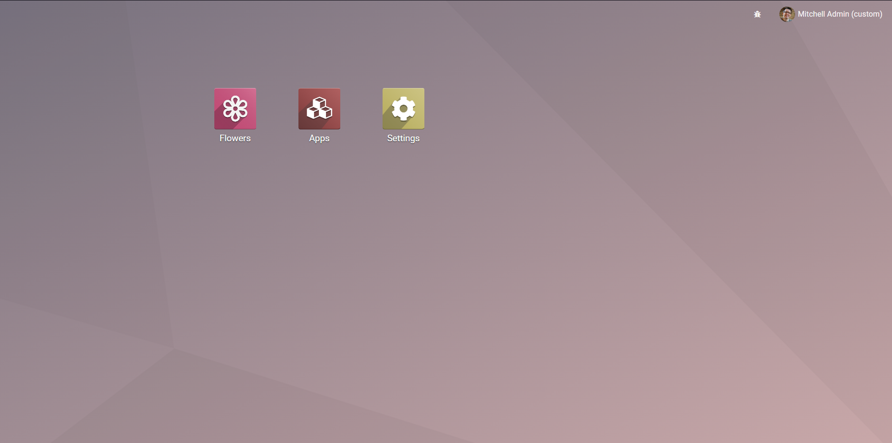
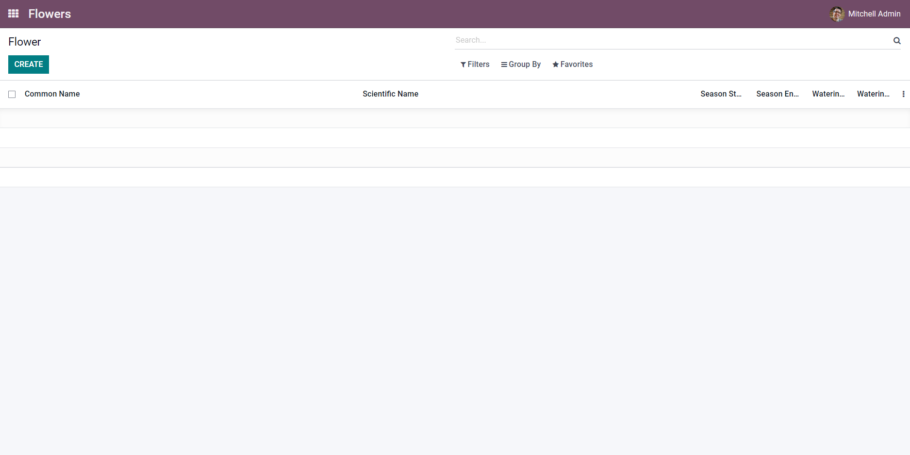
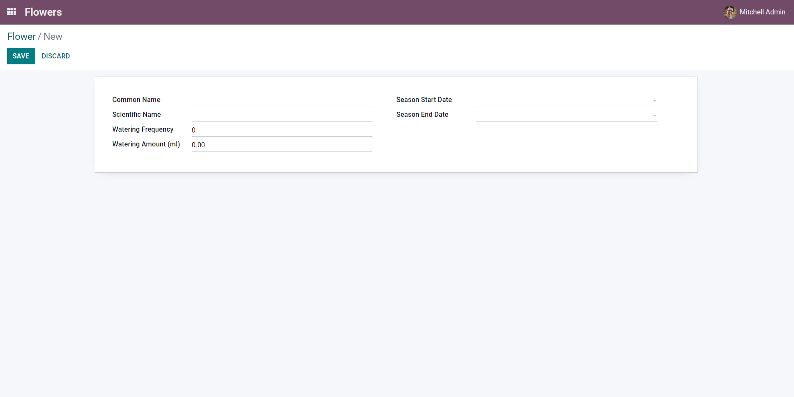

# Sally's Flower Shop - Part 1

[View the commit for this solution](https://github.com/odoo-ps/psae-btco/commit/27601745934143e124f6d9502a59203987c9884c)

The first step is to create a new module inside of the project folder. To do this, create a new folder for the module
and ensure that it contains `__init__.py` and `__manifest__.py`. Alternatively, we can use
the [scaffolder](https://www.odoo.com/documentation/15.0/developer/cli.html#scaffolding)
to automate the creation of the module.

We shall name our module `flower_shop`.

Next, we will create a
Python [model](https://www.odoo.com/documentation/16.0/developer/reference/backend/orm.html#models) to represent flowers
called `flower.py`. All Python models should be
placed inside `models` folder and the model files must be imported in `__init__.py` in the same folder. Moreover, the
entirety of `models` folder has to be imported in the module-level `__init__.py` file. Therefore, we get the following
file structure in our project so far:

```text
flower_shop
├── models
│   ├── flower.py
│   └── __init__.py
├── __init__.py
└── __manifest__.py
```

In `flower.py`, we will define the model with the necessary attributes. Odoo provides a variety
of primitive and
relational [fields](https://www.odoo.com/documentation/16.0/developer/reference/backend/orm.html#fields).

One of the attributes is <i>Season</i>. We can define a flower's season by specifying a start date and an end date.
Hence,
two date fields are needed to track seasons.

```python
season_start = fields.Date()
season_end = fields.Date()
```

<GitHubButton link="https://github.com/odoo-ps/psae-btco/blob/6adc65ac5398ed486c352d4f6dec770467a4f36e/flower_shop/models/flower.py#L11"></GitHubButton>

Often, it is helpful to provide tooltips especially if the field's label is not very obvious. This is achieved by using
the `help` field attribute. We will use this for the field _Watering frequency_.

```python
watering_frequency = fields.Integer(help="Frequency is in number of days")
```

<GitHubButton link="https://github.com/odoo-ps/psae-btco/blob/6adc65ac5398ed486c352d4f6dec770467a4f36e/flower_shop/models/flower.py#L12"></GitHubButton>

For any new model, we have to define
its [access rights](https://www.odoo.com/documentation/16.0/developer/reference/backend/security.html#access-rights).
This is defined in a CSV file. For now, we will grant full access to all users belonging to the
group `base.group_user` (
also known as internal users). Note that the name of the model uses the underscore notation and is prefixed by `model_`.

```text
id,name,model_id:id,group_id:id,perm_read,perm_write,perm_create,perm_unlink
access_flower,commission.type,model_flower_flower,base.group_user,1,1,1,1
```

<GitHubButton link="https://github.com/odoo-ps/psae-btco/blob/6adc65ac5398ed486c352d4f6dec770467a4f36e/flower_shop/security/ir.model.access.csv#L2"></GitHubButton>

We have to define [views](https://www.odoo.com/documentation/16.0/developer/howtos/backend.html#basic-views) for our new
model. In order to render a list of all the flower records in the database, we will
define a list, or more technically known, a tree view in XML. Furthermore, there will be a form view that would
display a single flower record. Like every other view in Odoo, these two views belong to the model `ir.ui.view` and are
stored as records in their respective PostgreSQL table. The way we specify the different types of views is by using
special tags like `form` or `tree` inside the `arch` field.

```xml
<?xml version="1.0" encoding="UTF-8" ?>
<odoo>
    <record id="..." model="ir.ui.view">
        ...
        <field name="arch" type="xml">
            <form>
                ...
            </form>
        </field>
    </record>
</odoo>
```

<GitHubButton link="https://github.com/odoo-ps/psae-btco/blob/6adc65ac5398ed486c352d4f6dec770467a4f36e/flower_shop/views/flower_views.xml#L7"></GitHubButton>

We now have a model and some way to render its records, but we have to define a way for the user to get to the views.
This brings us to [menu items](https://www.odoo.com/documentation/16.0/developer/howtos/backend.html#actions-and-menus) - interactive, clickable components that can redirect the user.
In addition, we have to let the menu item know what view to render and this is done by associating
a [window action](https://www.odoo.com/documentation/16.0/developer/reference/backend/actions.html#window-actions-ir-actions-act-window)
with it. Both menu items and actions can be either specified in the same file as the views or defined in their own
files, as long as they are included in the manifest. Moreover, it is important these XML records are loaded in an
orderly manner starting with views and actions and ending with menu items. In this example, we shall define them
separately in their respective files.

When a menu item does not have the `parent` attribute, it is considered a root, and it appears as an icon on the home
screen.
Moreover, we can bind an action and optionally provide an icon using the attributes `action` and `web_icon`
respectively.
If you wish to create Odoo-style icons, use this [tool](https://spilymp.github.io/ibo/).

```xml
<?xml version="1.0" encoding="UTF-8" ?>
<odoo>
    <menuitem id="..."
              name="..."
              action="xml_id_of_window_action"
              web_icon="module_name,static/description/icon.png"/>
</odoo>
```

<GitHubButton link="https://github.com/odoo-ps/psae-btco/blob/6adc65ac5398ed486c352d4f6dec770467a4f36e/flower_shop/views/menu_items.xml#L3"></GitHubButton>

Upon successful installation of the module, an app icon should appear on the home screen.


Once we click on the app, it should display the list/tree view of the model.


Here is the form view of the model.


This marks the completion of part 1 of the case study.