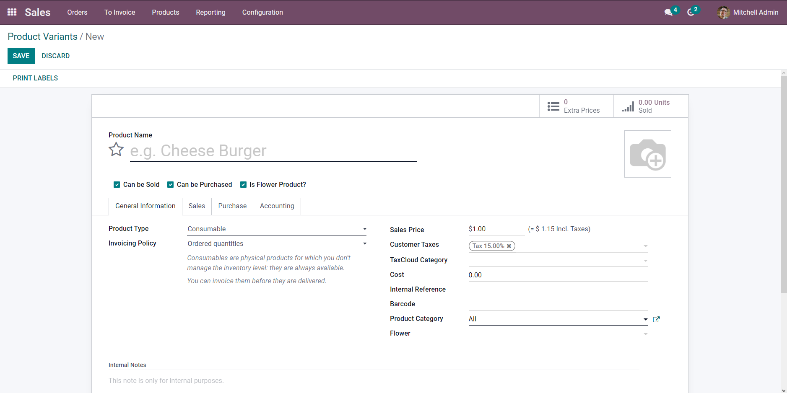

# Sally's Flower Shop - Part 2

[View the commit for this solution](https://github.com/odoo-ps/psae-btco/commit/bfc90b73ec1030971c4b4350c8ae35f9284b3036)

In this exercise, we are going to add
a [relation between two models](https://www.odoo.com/documentation/16.0/developer/howtos/backend.html#relations-between-models): `flower.flower`
and `product.product`. There are
a few judgement calls to be made before relating the two models.

### Judgement Calls

#### What relational field should I use?

What we need is a one-to-one mapping between a product and a flower. However, Odoo does not provide such a relation,
instead we will be using a `Many2one` relational field to achieve this mapping.

#### In which model should I place the field?

This is where we have to beg the question: "Do we need a reference to the product record from the flower record, or is
it the other way round?". The answer is that we need a reference to the flower record from the product record. This is
because in sale order lines we choose products not flowers, and a product may or may not be a flower.

#### What would be the consequence of placing the field in the other model?

The consequence would be doing a lot of search queries. Every time we would want to get a reference to the flower of a
product in a sale order line, it would require us to search through all the flower records where the product field
matches the product of the sale order line. On the other hand, following the other approach means getting the flower
record in the sale order line would be as simple as `product_id.flower_id`!

```python
class Product(models.Model):
    _inherit = "product.product"

    is_flower = fields.Boolean("Is Flower Product?")
    flower_id = fields.Many2one("flower.flower")
```

<GitHubButton link="https://github.com/odoo-ps/psae-btco/blob/6adc65ac5398ed486c352d4f6dec770467a4f36e/flower_shop/models/product.py#L10"></GitHubButton>

### View Inheritance for Product Variants

The next step is to add the fields in the form view of `product.product` model. Note that this view is for a product
variant, not a product template. In case you are unable to find this view, please install the Sales app (technical
name: `sale_management`). Also, this is the first time we are going to
do [view inheritance](https://www.odoo.com/documentation/16.0/developer/howtos/rdtraining/13_inheritance.html#view-inheritance)
because we will add fields to
an existing view.


### Writing Reliable XPath Expressions

It is important that
our [XPath expressions](https://www.odoo.com/documentation/16.0/developer/reference/backend/views.html#inheritance-specs) (`expr`
attribute) do not break or behave unexpectedly with future version releases. The easiest pitfall to avoid is to not use
list indexing e.g. `/div[1]`. Imagine what would happen if a sibling or a parent `div` element was added in a future
release. This expression would result in referring to the newly added element instead and hence, produce incorrect
behavior. A more reliable approach is to use attributes that may be unique to the element you are looking for. For
example, we use the `name` attribute with the value `categ_id` to look for a `field` element.

```xml
<?xml version="1.0" encoding="UTF-8" ?>
<odoo>
    <record id="..." model="ir.ui.view">
        ...
        <field name="arch" type="xml">
            <xpath expr="//field[@name='categ_id']" position="after">
                ...
            </xpath>
        </field>
    </record>
</odoo>
```

<GitHubButton link="https://github.com/odoo-ps/psae-btco/blob/6adc65ac5398ed486c352d4f6dec770467a4f36e/flower_shop/views/product_views.xml#L14"></GitHubButton>

### Window Action and Menu Item for Flower Products

Another requirement is to display all flower products with the click of
a [menu item](https://www.odoo.com/documentation/16.0/developer/howtos/backend.html#actions-and-menus). First, we will
define a window action where the field `res_model` will be `product.product` because we wish to view records of this
model. Then, we will specify the `domain` field in order to filter for flower products only. Moreover, the `view_mode`
will list all the view types in which the user can see the records. Lastly, since the user may create a new flower
product from these views, we want to set the boolean field `is_flower` in the record to true by default. To achieve
this, we will pass some default value through the `context` field.

```xml
<?xml version="1.0" encoding="UTF-8" ?>
<odoo>
    <record id="..." model="ir.actions.act_window">
        ...
        <field name="res_model">product.product</field>
        <field name="view_mode">kanban,tree,form,activity</field>
        <field name="context" eval="{'default_is_flower': True}"/>
        <field name="domain" eval="[('is_flower', '=', True)]"/>
        ...
    </record>
</odoo>
```

<GitHubButton link="https://github.com/odoo-ps/psae-btco/blob/6adc65ac5398ed486c352d4f6dec770467a4f36e/flower_shop/data/actions.xml#L9"></GitHubButton>

When creating the menu item, we have to identify the exact location for it. We want to place it under
Sales/Products menu and therefore, the `parent` field must be specified with the correct XML ID. Additionally, we have
to bind the window action to it, and we can optionally define a sequence to place it before or after one of its
sibling menu items. Note that whenever the XML ID of a record belongs to a different module, we have to use the module
name as a convention, in other words, _module_name.xml_id_. And since we are referring to another module, the module
must be added as a dependency in the manifest.

```xml
<?xml version="1.0" encoding="UTF-8" ?>
<odoo>
    <menuitem id="..." action="action_flower_product" parent="sale.product_menu_catalog"
              sequence="2"/>
</odoo>
```

<GitHubButton link="https://github.com/odoo-ps/psae-btco/blob/6adc65ac5398ed486c352d4f6dec770467a4f36e/flower_shop/views/menu_items.xml#L8"></GitHubButton>

By the end of this, you should have a menu item similar to the screenshot below.


### Product Domain in Sale Order Lines

The last bit of this exercise requires adding a domain on `product_id` field in the model `sale.order.line`. Upon
investigation, we find that the field already contains a domain defined in XML in the form view. To change this, we will
have to inherit the form view and add an XPath to modify the field's domain. However, we cannot afford to lose the old
domain by replacing with a new one as it may lead to unexpected behaviors. This is why we will copy-paste the existing
domain and modify it to ensure that only flower products are displayed in the lines.

```xml
<?xml version="1.0" encoding="UTF-8" ?>
<odoo>
    <record id="..." model="ir.ui.view">
        ...
        <field name="arch" type="xml">
            <xpath expr="//field[@name='order_line']/tree/field[@name='product_id']" position="attributes">
                <attribute name="domain">[('sale_ok', '=', True), '|', ('company_id', '=', False), ('company_id', '=',
                    parent.company_id), ('is_flower', '=', True)]
                </attribute>
            </xpath>
        </field>
    </record>
</odoo>
```

<GitHubButton link="https://github.com/odoo-ps/psae-btco/blob/6adc65ac5398ed486c352d4f6dec770467a4f36e/flower_shop/views/sale_order_views.xml"></GitHubButton>

This marks the completion of part 2 of the case study.