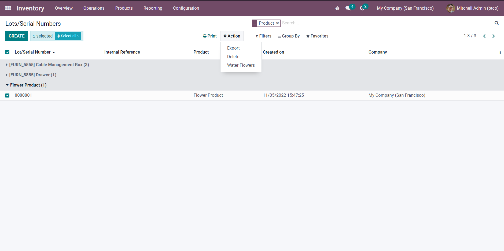
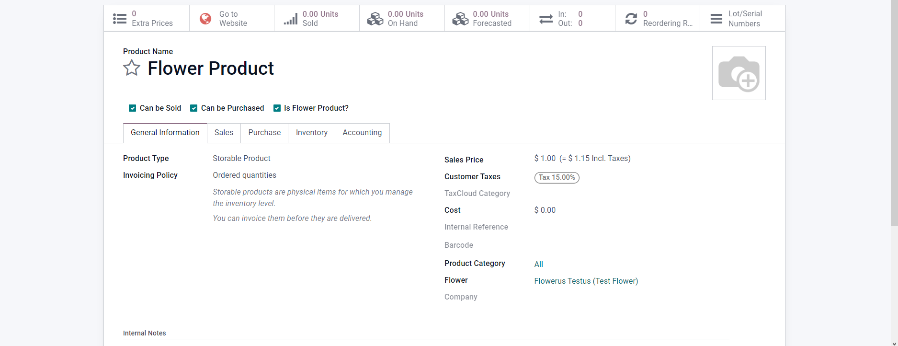

# Sally's Flower Shop - Part 4

[View the commit for this solution](https://github.com/odoo-ps/psae-btco/commit/e0ca8f6d454de2efce5f69d95f166eda816e4185)

For this exercise, we have to set the tracking of flower products to _By Unique Serial Number_. This option can be found
under the _Inventory_ tab in the product's form view.


### One-to-Many Relation

Once we create the new model for storing information about watering flowers, we have to establish a relationship
between `flower.water` and `stock.production.lot`. Note that we use `stock.production.lot` model in order to add serial
numbers to flowers. Moreover, one serial numbered flower can be watered multiple times, indicating that we need
a `one2many` field inside `stock.production.lot`. Whenever a `one2many` field is used, we have to specify the
attribute `inverse_name` which is the name of the `many2one` field in the other model. In our case, the `many2one` field
is called `serial_id`.

```python
class StockProductionLot(models.Model):
    _inherit = "stock.production.lot"

    water_ids = fields.One2many("flower.water", "serial_id")
```

<GitHubButton link="https://github.com/odoo-ps/psae-btco/blob/sally-flower-shop/flower_shop/models/stock_production_lot.py#L8"></GitHubButton>

```python
class FlowerWater(models.Model):
    _name = "flower.water"
    _description = "Flower Watering"
    _order = "date"

    serial_id = fields.Many2one("stock.production.lot")
```

<GitHubButton link="https://github.com/odoo-ps/psae-btco/blob/sally-flower-shop/flower_shop/models/flower_water.py#L9"></GitHubButton>

This relational field is _bidirectional_ in nature, meaning the user can either go to a serial numbered
flower to water it multiple times (i.e. add multiple `flower.water` records to `water_ids`), or set the `serial_id`
field inside a `flower.water` record. In both cases, the result will be the same.

### Action Button

We will add
an [action button](https://www.odoo.com/documentation/16.0/developer/howtos/rdtraining/10_actions.html#action-type) in
the form view of `stock.production.lot` model and bind a Python method to it. To implement this, first we will inherit
the form view and write an XPath expression to place the button in the form's header. Note that we added a
field `is_flower` which is related to `product_id.is_flower`. This field is then used to conditionally show the button.
Furthermore, the `name` attribute of the button is where a Python method is bound. Therefore, the next step is to define
the logic to execute once this button is pressed.

```xml
<?xml version="1.0" encoding="UTF-8" ?>
<odoo>
    <record id="..." model="ir.ui.view">
        ...
        <field name="inherit_id" ref="stock.view_production_lot_form"/>
        <field name="arch" type="xml">
            <xpath expr="//sheet" position="before">
                <header>
                    <field name="is_flower" invisible="1"/>
                    <button string="Water Flower" type="object" name="action_water_flower" class="oe_highlight"
                            attrs="{'invisible': [('is_flower', '=', False)]}"/>
                </header>
            </xpath>
        </field>
    </record>
</odoo>
```

<GitHubButton link="https://github.com/odoo-ps/psae-btco/blob/sally-flower-shop/flower_shop/views/stock_production_lot_views.xml#L11"></GitHubButton>

We will define a Python method `action_water_flower` that will check the last date a flower was watered and the
watering frequency. If the number of days passed since the last watering date is equal to or greater than the watering
frequency, create a `flower.water` record. The main challenge however, is to carry out this logic not for one but
multiple records. As a matter of fact, it is generally considered a good practice to write Python methods that can
handle a recordset because if the logic works for multiple records, then it will always work for a single record. On the
other hand, methods for handling single records do not necessarily work with multiple records.

```python
def action_water_flower(self):
    flowers = self.filtered(lambda rec: rec.is_flower)
    ...
    for record in flowers:
        if record.water_ids:
            last_watered_date = record.water_ids[0].date
            frequency = record.product_id.flower_id.watering_frequency
            today = fields.Date.today()
            if (today - last_watered_date).days < frequency:
                ...
                continue
        self.env["flower.water"].create({
            "serial_id": record.id,
        })
    ...
```

<GitHubButton link="https://github.com/odoo-ps/psae-btco/blob/sally-flower-shop/flower_shop/models/stock_production_lot.py#L12"><GitHubButton>

### Constraint

Adding [constraints](https://www.odoo.com/documentation/16.0/developer/howtos/backend.html#model-constraints) in models
is super easy. However, instead of adding a new method and using the decorator `constrains` we simply added a
check (i.e. the if-statement) inside `action_water_flower`. The rationale for this is that the only way a `flower.water`
record can be
created is through our defined method. The user cannot manually create or change a record. Hence, there is no need to
specify a model-level constraint.

### Server Action

[Server actions](https://www.odoo.com/documentation/16.0/developer/reference/backend/actions.html#server-actions-ir-actions-server)
are operations that can be performed automatically, or manually, on the recordset of a model. We defined a server action
in `actions.xml`. The best part about our server action is that it calls the same Python method we defined for our
action button (i.e. `action_water_flower`). Moreover, the action can be applied to multiple records thanks to the way
the method was implemented. Now, we can select several serial numbered flowers from the list view and run the server
action.



### Smart Button

Smart buttons are great visuals that can provide stats and references in a compact view. We will add a smart button
on `stock.production.lot` form view that will display all the watering times for a flower. This is completely optional
as you can simply add the field `water_ids` as
an [inline view](https://www.odoo.com/documentation/16.0/developer/howtos/rdtraining/12_sprinkles.html#inline-views)
instead. But for now, let us show off by adding a `button` element that has the class `oe_state_button`. Also, we will
bind a Python method so that when the smart button is clicked, it will redirect the user to a list view of watering
times.

```xml
<?xml version="1.0" encoding="UTF-8" ?>
<odoo>
    <record id="..." model="ir.ui.view">
        ...
        <field name="arch" type="xml">
            ...
            <xpath expr="//div[@name='button_box']" position="inside">
                <button class="oe_stat_button"
                        name="action_open_watering_times"
                        icon="fa-shower"
                        attrs="{'invisible': [('is_flower', '=', False)]}"
                        type="object">
                    <div class="o_field_widget o_stat_info">
                        <span class="o_stat_text text-wrap">Watering Times</span>
                    </div>
                </button>
            </xpath>
        </field>
    </record>
</odoo>
```

The method `action_open_watering_times` will return a window action that contains a lot of specifications such as the
type of action, the model, the view mode, etc. As opposed to creating an XML record for a window action
in [Part 2](https://odoo-ps.github.io/psae-btco/solutions/flower_shop_2.html#flower-only-products), we
are creating a window action on-the-fly by returning a dictionary from a Python method.

Here is how the form view would look like for a serial numbered flower record.


### Record Naming

If a model contains a character field called `name`, the ORM uses this field's value to render a label for the record.
For example, if you try to select a customer when creating a sale quotation, the drop-down shows records
of `res.partner` model either by name if the record is a company, or by name and the company name if it is an
individual. Since the `flower.flower` model does not have a `name` field, we have to override the method `name_get`. The
method returns a list of tuples where a tuple consists of the record's ID and a string as the label.

```python
def name_get(self):
    return [(flower.id, "{} ({})".format(flower.scientific_name, flower.common_name)) for flower in self]
```

This is how a flower record looked in `flower_id` field in `product.product` model's form view before overriding the
method.


And this is after overriding.


This marks the completion of part 4 of the case study.