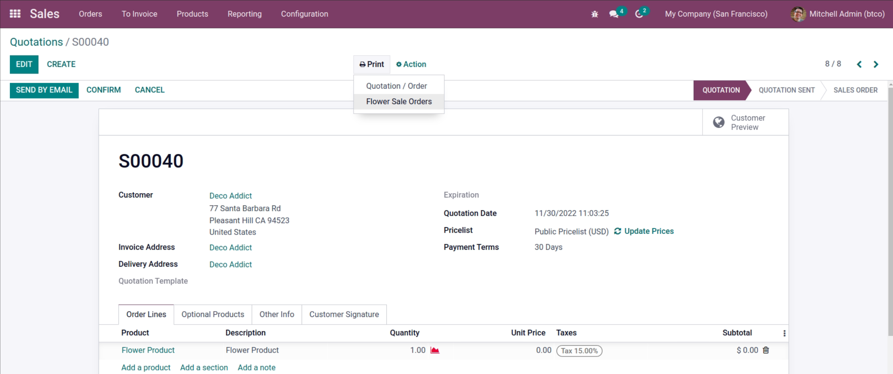

# Sally's Flower Shop - Part 5

[View the commit for this solution](https://github.com/odoo-ps/psae-btco/commit/5088283184d9ec45cc48a9893c4555f37c8cd1cc)

This exercise is all
about [QWeb reports](https://www.odoo.com/documentation/16.0/developer/reference/frontend/qweb.html). Since the
documentation does an amazing job in explaining the syntax, we will cover some practices that we do when creating
reports.

### File Structure

All report-related Python and XML files are placed in a separate folder named `reports`. Once we create the
folder, we will create an XML file to define our QWeb report template
with [minimal viable template](https://www.odoo.com/documentation/16.0/developer/reference/backend/reports.html?minimal-viable-template#minimal-viable-template)
and the file name will be `flower_sale_order_views.xml`.

### Subtemplates and Variables

It can be noted that before calling the subtemplate `web.external_layout_boxed`, we set some values for the two
variables `report_header_style` and `footer`. This is because in the source code this subtemplate uses these variables
to specify classes and styles for certain `div` elements. In our case, we wish to hide these elements and not include
them in our report. Since
using [template inheritance](https://odoo-ps.github.io/psae-btco/solutions/flower_shop_3.html#template-inheritance)
would remove the elements from all the reports that are calling the subtemplate (dangerous!), we will only remove them
from this report by simply setting the variables. Note that QWeb variables are shared across templates and hence,
setting these variables would pass our values to the subtemplate before rendering it.

```xml
<?xml version="1.0" encoding="UTF-8" ?>
<odoo>
    <template id="...">
        <t t-call="web.html_container">
            <t t-set="company" t-value="docs[0].company_id"/>
            <t t-set="report_header_style" t-value="'display: none;'"/>
            <t t-set="footer" t-value="'oe_hidden'"/>
            <t t-call="web.external_layout_boxed">
                ...
            </t>
            ...
        </t>
    </template>
</odoo>
```

<GitHubButton link="https://github.com/odoo-ps/psae-btco/blob/sally-flower-shop/flower_shop/reports/flower_sale_order_views.xml#L6"></GitHubButton>

### Paper Format

Sometimes clients require special page formats and sizes to print their data. An example of a use case would be label
printing. For such requirements, we
create [paper formats](https://www.odoo.com/documentation/16.0/developer/reference/backend/reports.html#paper-format)
and do not tinker with dimensions directly in report templates. Moreover, it is important to note that margins have
non-zero
default values. This means we have to ensure that we set margins to zero in our case. In addition, we can create the
paper
format record either in the same file as the report template, or in a new file (like `paperformat.xml`) in the `data`
folder.

```xml
<?xml version="1.0" encoding="UTF-8" ?>
<odoo>
    <record id="..." model="report.paperformat">
        ...
        <field name="margin_top">0</field>
        <field name="margin_bottom">0</field>
        <field name="margin_left">0</field>
        <field name="margin_right">0</field>
        ...
    </record>
</odoo>
```

<GitHubButton link="https://github.com/odoo-ps/psae-btco/blob/sally-flower-shop/flower_shop/data/paperformat.xml"></GitHubButton>

### Report Action

This [action](https://www.odoo.com/documentation/16.0/developer/reference/backend/actions.html#report-actions-ir-actions-report)
is responsible for triggering the printing of a report. The field `report_name` is where we specify the XML ID of the
report template. When triggered, the action will fetch all the records of the desired model defined through the7 `model`
field. Also,
in report actions we tie the template and the paper format together (see `paperformat_id` field).
In addition, we want the report to appear in the _Print_ options of sale orders and therefore, we assign the appropriate
model name to the field `binding_model_id`. Lastly, the report action can be either placed in the same file as the
template and the paper format, or it can have a dedicated file. However, it is important that the action is placed or
loaded **after** them as it refers to their XML IDs.

```xml
<?xml version="1.0" encoding="UTF-8" ?>
<odoo>
    <record id="..." model="ir.actions.report">
        ...
        <field name="model">sale.order</field>
        <field name="report_name">flower_shop.flower_sale_order</field>
        <field name="binding_model_id" ref="sale.model_sale_order"/>
        <field name="binding_type">report</field>
        <field name="paperformat_id" ref="paperformat_flower_sale_order"/>
    </record>
</odoo>
```

<GitHubButton link="https://github.com/odoo-ps/psae-btco/blob/sally-flower-shop/flower_shop/data/actions.xml#L30"></GitHubButton>

If successful, the report action should look like this under the _Print_ options.



### Custom Reports

The report data (i.e. records) when passed to the template are referred to as `docs`. However, it is possible for us to
inject additional data into the template. This can be very useful when
creating [custom reports](https://www.odoo.com/documentation/16.0/developer/reference/backend/reports.html#custom-reports)
and involving records from different models and applying calculations prior to rendering.

Here is a glimpse of the final report.


This marks the completion of part 5 of the case study.